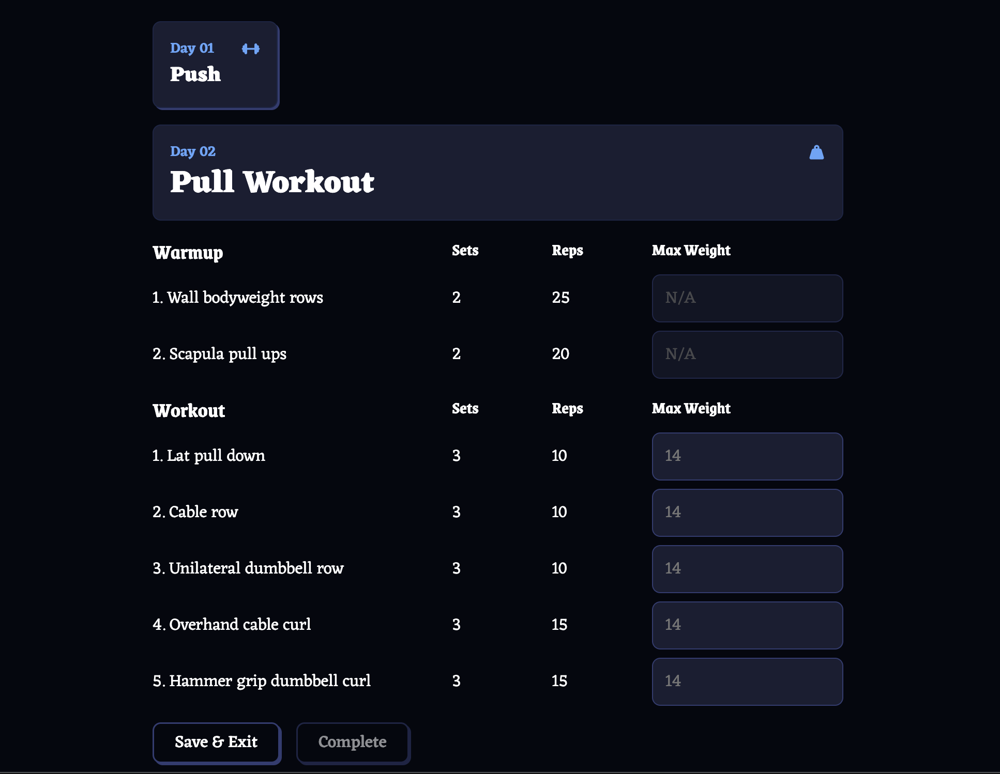

README
# Web Gym Bro: Your Online Workout Helper

## Overview
Web Gym Bro is built using React and JavaScript.
It's a web-based gym tracker designed to follow workout plans and track gym progress.

## Try it here
https://webgymbro.netlify.app/

## Quick Display

## Future Improvement:
1. Introduce database and add sign-in and login functionality
2. Allow users to pick an avatar 
3. Keep track of users' gym progress
4. Send notification emails if users have been slacking

